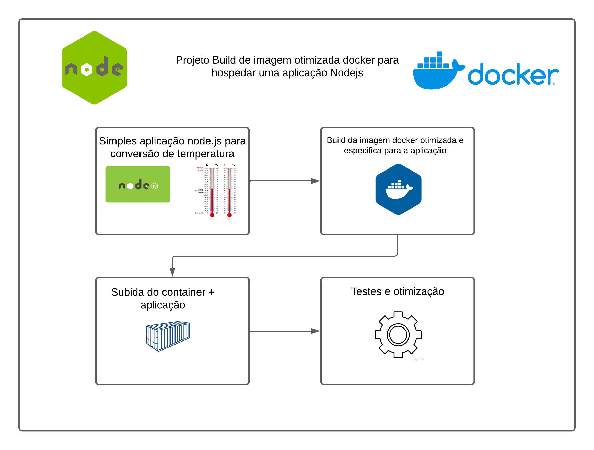
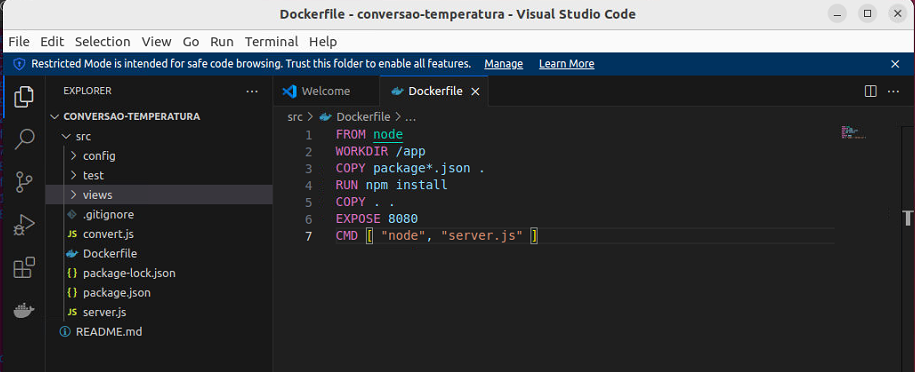
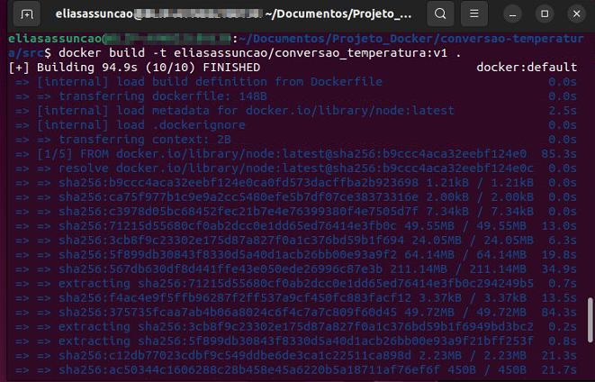
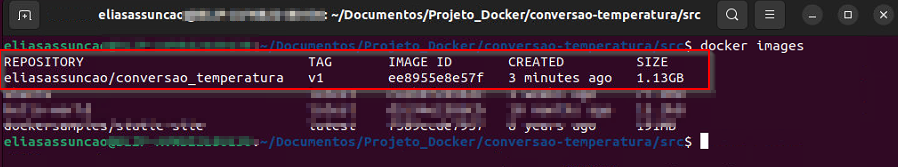
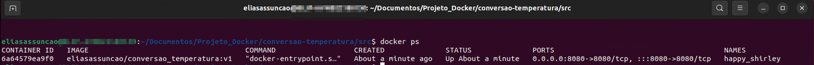
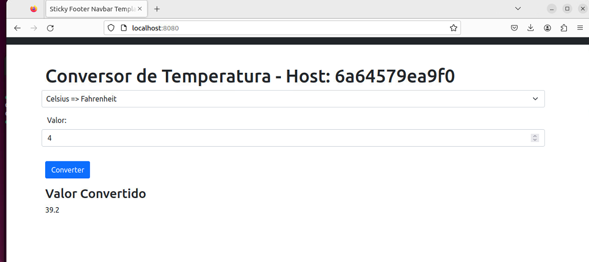

# DOCKER "Criando uma imagem docker e hospedando uma aplicação Node.js"


**Objetivo**:

O objetivo deste projeto é demonstrar habilidades práticas em Docker, enfatizando a criação e gestão de uma imagem personalizada para uma aplicação Node.js. E não no desenvolvimento da aplicação em si, o foco será na configuração e implantação eficazes utilizando Docker.

## 📌 Requisitos

Certifique-se de ter o Docker instalado no seu sistema. Se necessário, você pode seguir o link da documentação oficial [Como instalar o Docker](https://docs.docker.com/engine/install/)


## 📦 Documentação

**Criação do Dockerfile**

Fizemos a criação da imagem do nosso container



FROM: utiliza uma imagem do dockerhub como base
WORKDIR: define nosso diretorio de trabalho
COPY: Utilizado para copiar os pacotes necessarios
RUN: Roda o comando para instalar os pacotes copiados
COPY: Copia nosso projeto
EXPOSE: Expoe a porta do nosso container
CMD: Para iniciar nossa aplicação 

**Build da imagem Docker**

Apos a criação do nosso Dockerfile, vamos buildar a nossa imagem, para isso utilizamos o comando

```
docker build -t

```



**Validando a criação da imagem**

Para verificar se a imagem foi criada corretamente, podemos utilizar o seguinte comando

```
docker images
```



Assim conseguimos ter acesso a varias informações importantes do container

**Subindo nosso container**

Apos buildar nossa imagem, podemos subir nosso container. Vamos utilizar o comando

```
docker run -d -p 8080:8080 (nome da imagem)
```
Não esqueça de especificar as portas corretas.

**Validando se o container esta no AR**

Para verificar se o container subiu corretamente, podemos dar o seguinte comando

```
docker ps
```



## Nossa aplicação

Para finalizar, vamos acessar nossa aplicação utilizando nosso navegador




⌨️ com ❤️ por [Elias Assunção](https://github.com/Hooligam) 🔥

